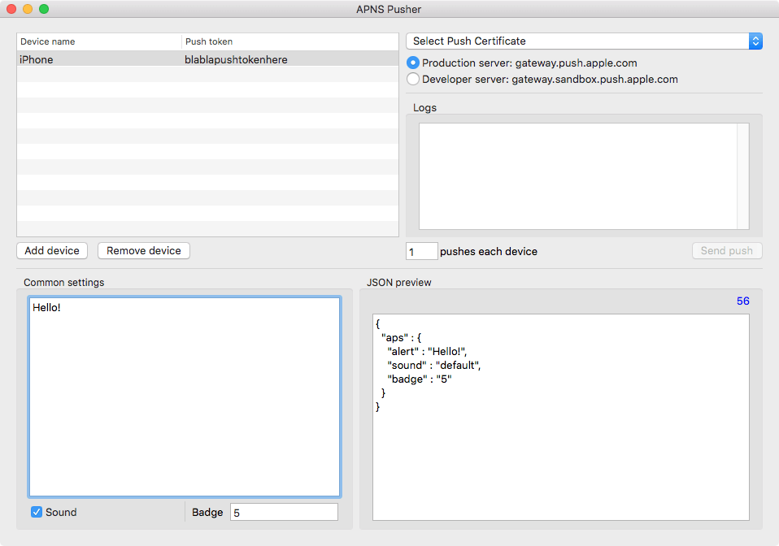

# APNS Pusher

Native macOS application to send iOS Push Notifications using Apple Push Notification Service directly.

### Prerequisites

This application was written in 2014 to test APNS directly without bothering backend developers.
It helped a lot to detect wrong iOS build and backend configurations (like wrong provision profiles).
Also it was used to stress test APNS by sending multiple notifications to one device.

Application should be able to build targeting OS X up to 10.7.
OS X 10.6 is lacking `weak` support but it can be targeted with some code modifications.
Application uses socket connection to APNS and CoreData to store device names and push tokens.
Push notification certificates are pulled directly from the Keychain.

### Installing

1. Download this project.
2. Open `APNS Pusher.xcodeproj`
3. Run

## Contributing

This is a legacy project and my first macOS application. It is not maintained anymore. You can send some pull requests but I do not promise I will have time to review and accept them.

## License

This project is licensed under the MIT License - see the [LICENSE.md](LICENSE.md) file for details

## Acknowledgments

* [CocoaAsyncSocket](https://github.com/robbiehanson/CocoaAsyncSocket) for GCDAsyncSocket library
* [Pusher](https://github.com/danschmidt1/Pusher) for the inspiration
* [pixabay.com](https://pixabay.com) for this fancy [icon](https://pixabay.com/en/drawing-pin-pushpin-push-pin-147814/)
